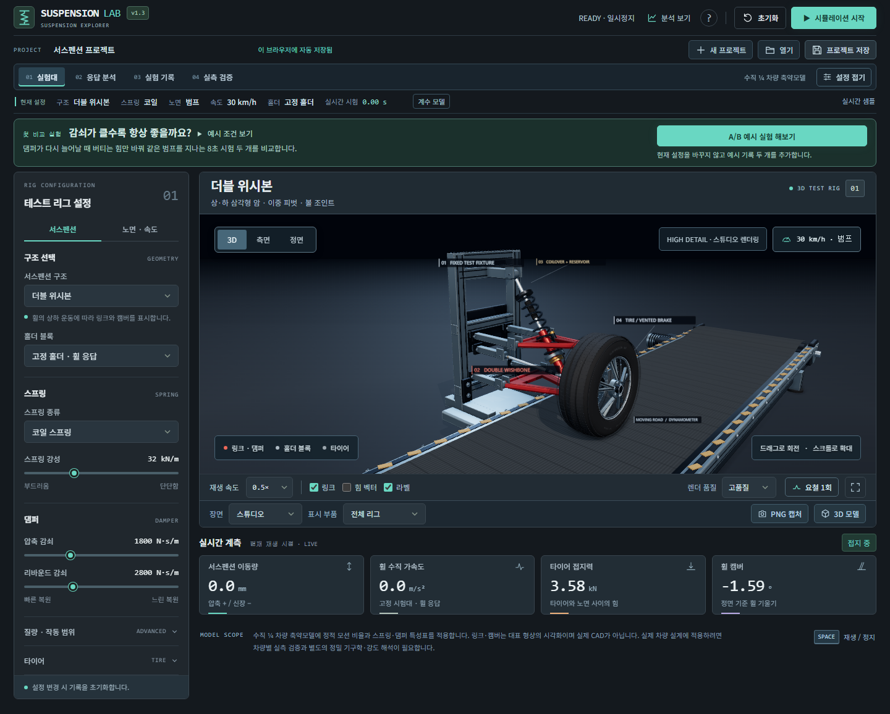
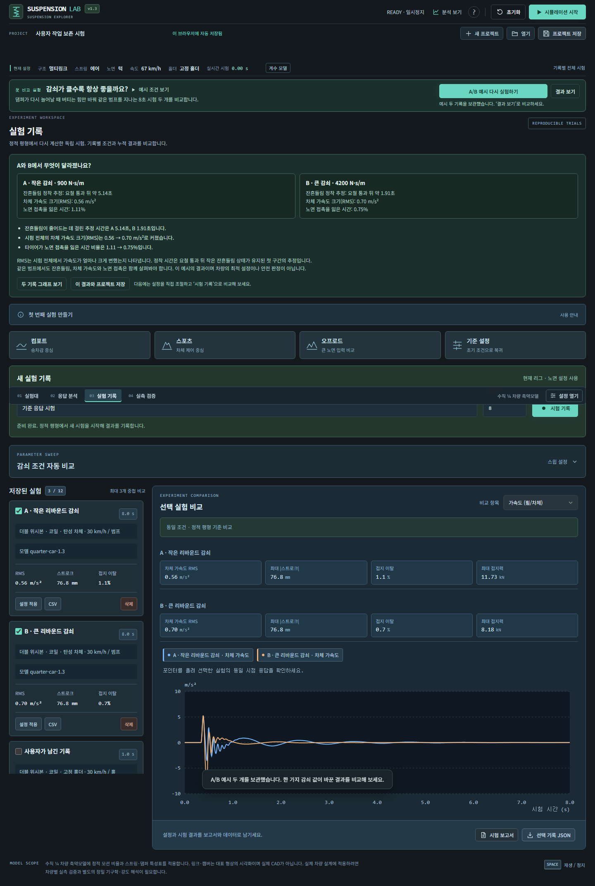
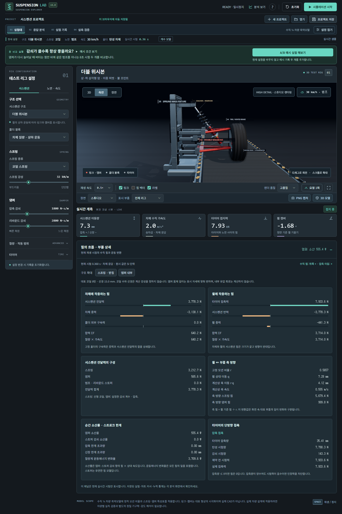
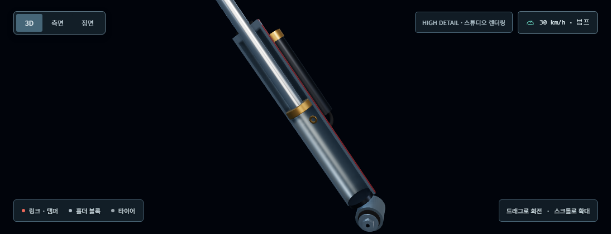

# Suspension Lab

노면과 스프링·댐퍼 조건을 바꾸며 한 바퀴의 움직임을 관찰하는 **Windows 3D 체험·실험 앱**입니다. 움직임을 본 뒤 차체 가속도, 서스펜션 이동량과 접지력 그래프로 같은 조건의 결과를 비교합니다.

**공개판 1.3.0 · 일반 체험용 기술 검증 완료.** 모델은 `quarter-car-1.3`입니다. 화면·조작·저장·오프라인·독립 EXE·설치 파일 내용 대조와 기존 설치본 업데이트를 확인했습니다. 배포 위치는 [GitHub Releases](https://github.com/Ulsancl/suspension-simulator/releases)이며 설치 파일의 실제 제공 여부는 해당 페이지에서 확인합니다. [제품 평가 기록](docs/consumer-release.md)에 검사 환경과 한계를 기록합니다. 기술 검증과 유료 판매 개시는 별도입니다.



*1.3.0의 실제 앱 화면입니다. 아래 A/B 예시는 한 변수만 바꾼 두 기록을 비교합니다.*



## 1.4 상세 개선 검토본

이 브랜치는 공개판 1.3에서 이어지는 상세 개선본입니다. 기존 `quarter-car-1.3` 계산과 프로젝트·실험 기록 형식을 유지합니다. 새 설치 파일의 정식 공개 여부는 Releases에서 확인하세요.

- 코일 표면 방향과 끝마개를 수정하고, 받침면 접촉과 고정 코일 수·선경의 간격을 검증합니다. 맥퍼슨의 대표 코일 수는 짧은 관찰 구간에도 맞도록 조정합니다.
- **실험대 → 힘의 흐름 · 부품 상세**에서 차체·휠 힘수지, 모션비에 따른 축 이동·힘, 댐퍼·스토퍼 소산률, 타이어 접촉 제한, 에어 압력·용적을 읽습니다.
- **스프링 · 받침 / 댐퍼 내부**로 대표 구조를 관찰하고 **원래 시점으로** 복원합니다. 단면보기는 계산을 바꾸지 않으며 GLB는 현재 자세의 전체 조립체를 내보냅니다.

자세한 의미와 한계는 [상세 계측](docs/detail-refinement.md)과 [구조 표현](docs/anatomy-detail.md)에 기록합니다. 댐퍼 몸체는 화면 자세에 맞춰 길이가 변하는 대표 형상이며 내부 유압 회로·실제 부품 강성·CAD 치수 검증을 추가한 것은 아닙니다.





1.4.0 로컬 검증은 수치·기하 85개, 웹 통합 93개, 소스 Windows 앱 15개와 패키지 실행본 15개로 총 208개를 통과했습니다. 실제 단면·모바일 화면과 전체 GLB를 확인했고 설치 파일의 SHA-256 및 포함 문서를 대조했습니다. 설치 파일은 서명되지 않았으며, 기존 앱 설치·공개 릴리스를 변경하지 않았습니다. 원격 검증 상태는 Actions에서 별도로 확인합니다.

## 처음 해 볼 실험

**감쇠가 클수록 항상 좋을까요?** 안내의 **A/B 예시 실험 해보기**를 누르면 사용자의 현재 설정을 유지하면서 서로 비교할 기록 두 개를 계산합니다. 두 기록은 탄성 차체·더블 위시본·코일 스프링, 30 km/h, 높이 6 cm 범프 한 번, 시험 시간 8초라는 같은 조건을 사용합니다. 리바운드 감쇠만 A **900**, B **4,200 N·s/m**로 바꿉니다.

결과에서는 실제 계산한 **차체 가속도 RMS, 잔흔들림 정착 추정, 노면 접촉을 잃은 시간 비율**을 함께 읽습니다. 8초 안에 정착을 확인하지 못하면 그 사실을 표시하며 0초로 바꾸지 않습니다. **두 기록 그래프 보기**로 같은 시간축에 놓고, 프로젝트 파일로 결과를 보관합니다. 두 기록을 넣을 공간이 없거나 계산을 취소하면 기존 기록을 유지합니다. 안내·완료·취소·복원과 화면 배치 검사를 통과했습니다.

그다음 노면·속도·스프링·감쇠 중 한 조건만 직접 바꿔 시험 기록을 비교해 보세요. 더 큰 감쇠가 모든 지표에 유리한지는 조건과 결과를 함께 확인해야 합니다.

## 설치와 실행

릴리스 페이지에서 `Suspension-Lab-Setup-1.3.0.exe`와 같은 이름의 `.sha256` 파일을 함께 확인합니다. 소스에서 패키징하면 `release/windows/`에 생성됩니다.

설치 파일을 실행한 뒤 바탕화면 또는 시작 메뉴의 **Suspension Lab** 아이콘을 클릭합니다. Windows **x64**, WebGL 2 그래픽 환경을 대상으로 합니다. 실행 환경을 포함하므로 설치한 앱은 첫 실행부터 인터넷·Node.js·별도 서버 없이 사용할 수 있습니다. 디지털 서명과 자동 업데이트는 없으며 새 설치 파일로 갱신합니다.

Space로 재생·정지, R로 초기화, F로 3D 확대, F11로 전체 화면을 전환합니다. 마우스로 장면을 회전·확대·이동합니다. 메뉴 **도움말 → 저장 폴더 열기**에서 `%APPDATA%\Suspension Lab`을 확인합니다.

## 관찰과 비교

| 작업공간 | 할 수 있는 일 |
| --- | --- |
| 실험대 | 더블 위시본·멀티링크·맥퍼슨, 코일·점진형·에어, 홀더와 노면 조건 변경 |
| 응답 분석 | 변위·가속도·접지력, 범례·시간 창·커서와 집중 보기 |
| 실험 기록 | 표준 시험 기록, 최대 12개 보관과 3개 중첩, 감쇠 후보 비교·보고서 |
| 실측 검증 | 단위를 명시한 CSV와 시간 오프셋, 모델 대비 오차 계산 |

설정을 바꾸면 정적 평형에서 시험을 시작합니다. 표준 기록은 1–30초를 계산하며 화면 재생 속도는 기록의 물리 시간을 바꾸지 않습니다. PNG는 현재 화면, GLB는 현재 자세의 조립체와 메타데이터를 내보냅니다. GLB는 검증된 차량 CAD나 동적 애니메이션 파일이 아닙니다.

## 기록 보관과 복구

현재 설정과 보관 기록은 앱 저장소에 자동 저장하고 **프로젝트 저장/열기**로 JSON 백업과 이동을 지원합니다. 실시간 재생 이력은 닫기 전에 시험 기록으로 보관합니다. 원본 실측 CSV는 프로젝트 JSON에 포함하지 않으므로 별도 파일로 유지합니다.

이전 모델의 지원되는 기록은 **원래 샘플·지표·모델 버전의 읽기 전용 기록**으로 엽니다. 현재 모델로 다시 계산해 이전 결과인 것처럼 표시하지 않습니다. 비교와 CSV·보고서 내보내기는 가능하며 현재 모델에서 새 시험을 만들 수 있습니다.

지원하지 않는 미래 형식이나 손상 원문도 원본을 보존합니다. 백업이나 저장 공간 사용에 실패하면 메모리 보관을 표시하므로 앱을 닫기 전에 프로젝트 파일을 저장하십시오. **원문 내려받기**와 **보관 기록 복구**의 차이, 이전 모델과 새로운 작업을 함께 보관하는 방법은 [저장과 복구 안내](docs/storage-recovery.md)에 있습니다.

## 모델과 고급 기능의 범위

`quarter-car-1.3`은 수직 단일 휠의 축약 해석 모델입니다. 표시 링크는 구조를 이해하기 위한 대표 형상이며 특정 차량의 하드포인트와 실제 부품 시험 데이터를 제공하지 않습니다. 정적 모션비를 시험 중 일정하게 사용하는 등 가정은 [모델 설명](docs/model.md)에 기록합니다. 실차 설계·정비·안전 승인이나 부품 강도 검증을 제공하는 제품은 아닙니다.

부품 힘 곡선 JSON, 실측 CSV의 명시 단위·부호·보간, 선형 모드와 오차 지표 등 고급 기능은 계속 제공합니다. 형식 예제는 수식으로 생성한 예제이며 실측 성능 데이터가 아닙니다. 과거 **Engineering Preview** 명칭과 [엔지니어링 적용 조건](docs/engineering-release.md)은 해당 고급 기능의 범위를 설명하는 자료이며 일반 체험용 평가를 차량별 타당성 검증으로 바꾸지 않습니다. 현재 설치·저장·업데이트 안내와 이전 1.2.0 검증 이력은 [Windows 설치·배포 안내](docs/desktop-release.md)에 있습니다.

## 소스 실행과 재현 검증

Node.js **22.12 이상**과 npm을 준비합니다. CI는 확인한 Node.js 24.19.0과 lockfile을 사용합니다.

```text
npm ci
npm run dev -- --port 5173 --strictPort
```

Windows에서는 `시작.cmd`로도 소스 실행을 준비할 수 있습니다. 정적 빌드와 Windows 설치본을 만드는 명령은 다음과 같습니다.

```text
npm run build
npm run desktop
npm run package:desktop
```

수치 검사는 `npm test`입니다. 웹·제품·화면 검사는 Chromium 설치 후 개발 서버 5173에서 실행합니다. 저장 회귀 검사는 전용 서버를 직접 준비합니다.

```text
npx playwright install chromium
npm test
npm run test:browser
npm run test:product
node tests/experiment-migration-browser.test.mjs
npm run test:desktop
```

CI는 모델·제품·저장·화면·오프라인·소스 앱·독립 실행 배포본을 순서대로 검사합니다. 실제 1.3.0 결과와 한계는 [제품 평가 기록](docs/consumer-release.md)에서 확인합니다. 원본 `output/`에는 테스트 프로필과 개인 경로가 포함될 수 있어 공개 소스에서 제외하고 제품 화면과 검사 요약만 선별합니다. 설치 EXE와 SHA-256은 Git 소스 대신 릴리스 자산으로 제공합니다.

1.3.0은 단위 66개와 웹·제품·화면·안내·저장·오프라인 회귀를 통과했습니다. 소스 데스크톱과 깨끗한 공개본에서 만든 독립 EXE는 각각 14개, 소스·빌드·설치 파일 대조는 9개 검사를 통과했습니다. 실제 NSIS 설치와 1.2.0에서 1.3.0으로의 업데이트, 기존 설정·기록 유지와 바로가기를 확인했습니다. 서명 상태는 `NotSigned`이며 설치 파일 확인에는 동명 `.sha256`을 사용합니다. 원격 CI 성공을 이 로컬 평가에 포함하지 않으며 실제 실행 이력은 [Actions](https://github.com/Ulsancl/suspension-simulator/actions)에서 확인합니다.

앱 자체는 기존 **UNLICENSED** 권리 유보 상태를 유지합니다. 소스 공개가 새 재배포 허락이나 판매 계약을 부여하지 않습니다. [제삼자 고지](docs/THIRD-PARTY-NOTICES.md)를 함께 확인하십시오.
